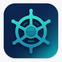

<p align="center">
  
</p>

<h1 align="center">Helm</h1>

<p align="center">
  A desktop port manager for local dev servers — see, kill, and free ports without memorizing <code>netstat -ano</code> flags.
</p>

<p align="center">
  <a href="LICENSE"></a>
  <a href="https://github.com/JinMXu/Helm/actions"></a>
</p>

---

## Features

- **Smart detection** — identifies dev servers via Git repo, process name whitelist, and Docker detection
- **Local-only by default** — filters to `localhost` / `127.0.0.1` / `0.0.0.0` / `::1`, toggle to see all ports
- **Process details** — expand a row to see Git branch, repo name, uptime, full command line
- **Kill ports** — graceful (SIGTERM) + force kill (SIGKILL), with toast feedback
- **Find free port** — tries preferred ports, falls back to OS-assigned ephemeral
- **Open in browser** — one-click `http://localhost:{port}`
- **System tray** — resident; click to toggle the window
- **i18n** — Chinese / English, auto-detects system language, persisted toggle

## Screenshots

<p align="center">
  <em>Compact rows with expandable details — Git branch, repo, uptime, command line</em>
</p>

## Installation

Download the latest installer from [Releases](https://github.com/JinMXu/Helm/releases):

| Platform | Package |
|----------|---------|
| Windows  | `Helm_x64-setup.exe` (NSIS) or `.msi` |
| macOS    | `Helm_aarch64.dmg` (Apple Silicon) / `Helm_x64.dmg` (Intel) |
| Linux    | `Helm_amd64.AppImage` or `.deb` |

## Dev Server Detection Rules

Helm classifies a process as a dev server when all of these hold:

1. **TCP LISTEN** state
2. **Port range** 1024–49151 (excludes system ports < 1024 and ephemeral ports ≥ 49152)
3. **One of:**
   - Process CWD is inside a **Git repository** → strongest signal
   - Process name matches a **known runtime** (`node`, `python`, `go`, `java`, `ruby`, `bun`, `deno`, `elixir`, `php`, `gunicorn`, `uvicorn`, `puma`, `mix`, `air`, etc.)
   - Process is a **Docker daemon** (`com.docker.*`, `vpnkit`)
   - CWD directory name is meaningful and matches a runtime (e.g. `my-go-project` won't match, but `node` will)

The display name is resolved with priority: Git repo root name → `Docker` → CWD directory name → process name.

## Development

### Prerequisites

- **Rust** 1.75+
- **Node** 20+ & **pnpm** 9+
- **Windows:** MSVC Build Tools + Windows SDK
- **Linux:** `libwebkit2gtk-4.1-dev libappindicator3-dev librsvg2-dev patchelf`

### Quick Start

```bash
# Install frontend dependencies
cd crates/helm-tauri/frontend
pnpm install

# Development mode (hot reload)
cd ../..
cargo tauri dev

# Production build
cargo tauri build
```

## Architecture

```
crates/
├── helm-core/       # Cross-platform port scanning, process info, Git detection, port killer
├── helm-cli/        # clap-based CLI binary (helm list / info / tree / kill / free)
└── helm-tauri/      # Tauri v2 + Svelte 5 + Tailwind GUI, system tray
```

### Tech Stack

| Layer    | Technology              |
|----------|-------------------------|
| Runtime  | Tauri v2 (Rust)         |
| UI       | Svelte 5 + Tailwind CSS |
| Build    | Vite + pnpm             |
| Scanning | netstat2 + sysinfo      |

## License

[MIT](LICENSE) © JinMXu
