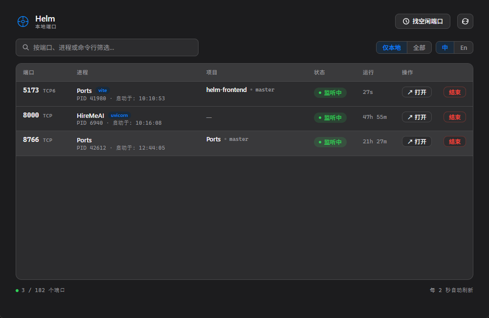

<p align="center">
  
</p>

<h1 align="center">Helm</h1>

<p align="center">
  本地开发服务器端口管理工具 —— 查看、终止、释放端口，不再记忆 <code>netstat -ano</code> 命令。
</p>

<p align="center">
  <a href="LICENSE"></a>
  <a href="https://github.com/JinMXu/Helm/actions"></a>
  <a href="README.md">English</a>
</p>

---

## 功能

- **智能识别** — 基于 Git 仓库、进程名白名单、Docker 检测自动筛选开发服务器
- **仅显示本地** — 默认过滤到 `localhost` / `127.0.0.1` / `0.0.0.0` / `::1`；可切换查看全部端口
- **项目感知** — 一眼看到项目名和 Git 分支
- **展开详情** — 点击行展开查看 Git 分支、仓库名、运行时长、完整命令行
- **终止端口** — 优雅终止（SIGTERM）+ 强制终止（SIGKILL），带 Toast 反馈
- **找空闲端口** — 优先推荐常用端口，兜底扫描范围
- **浏览器打开** — 一键打开 `http://localhost:{port}`
- **键盘快捷键** — `/` 搜索、`r` 刷新、`Esc` 收起
- **系统托盘** — 常驻后台，点击切换窗口
- **国际化** — 中文 / 英文切换，自动检测系统语言，设置持久化
- **深色模式** — 跟随系统主题

## 截图

<p align="center">
  
</p>

<p align="center">
  <em>6 列表格，点击展开查看项目名、Git 分支、运行时长、命令行等详情</em>
</p>

## 安装

从 [Releases](https://github.com/JinMXu/Helm/releases) 下载最新安装包：

| 平台   | 安装包 |
|--------|--------|
| Windows | `Helm_x64-setup.exe` (NSIS) 或 `.msi` |
| macOS   | `Helm_aarch64.dmg` (Apple Silicon) / `Helm_x64.dmg` (Intel) |
| Linux   | `Helm_amd64.AppImage` 或 `.deb` |

## 开发服务器识别规则

Helm 将以下进程判定为开发服务器：

1. **TCP LISTEN** 状态
2. **端口范围** 1024–49151（排除系统端口 < 1024 和临时端口 ≥ 49152）
3. **满足以下任一条件：**
   - 进程工作目录在 **Git 仓库** 内 → 最强信号
   - 进程名匹配**已知运行时**（`node`、`python`、`go`、`java`、`ruby`、`bun`、`deno`、`elixir`、`php`、`gunicorn`、`uvicorn`、`puma`、`mix`、`air` 等）
   - 进程为 **Docker 守护进程**（`com.docker.*`、`vpnkit`）
   - CWD 目录名有意义且匹配运行时（如 `node` 匹配，`my-go-project` 不匹配）

显示名优先级：Git 仓库根目录名 → `Docker` → CWD 目录名 → 进程名。

## 开发

### 环境要求

- **Rust** 1.75+
- **Node** 20+ 和 **pnpm** 9+
- **Windows:** MSVC Build Tools + Windows SDK
- **Linux:** `libwebkit2gtk-4.1-dev libappindicator3-dev librsvg2-dev patchelf`

### 快速开始

```bash
# 安装前端依赖
cd crates/helm-tauri/frontend
pnpm install

# 开发模式（热更新）
cd ../..
cargo tauri dev

# 生产构建
cargo tauri build
```

## 架构

```
crates/
├── helm-core/       # 跨平台端口扫描、进程信息、Git 检测、端口终止
├── helm-cli/        # clap 命令行工具 (helm list / info / tree / kill / free)
└── helm-tauri/      # Tauri v2 + Svelte 5 + Tailwind GUI，系统托盘
```

### 技术栈

| 层级     | 技术                    |
|----------|------------------------|
| 运行时   | Tauri v2 (Rust)         |
| 前端 UI  | Svelte 5 + Tailwind CSS |
| 构建工具 | Vite + pnpm             |
| 端口扫描 | netstat2 + sysinfo      |

## License

[MIT](LICENSE) © JinMXu
